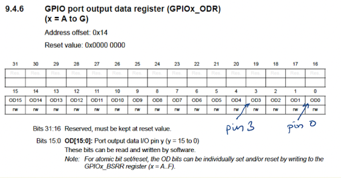
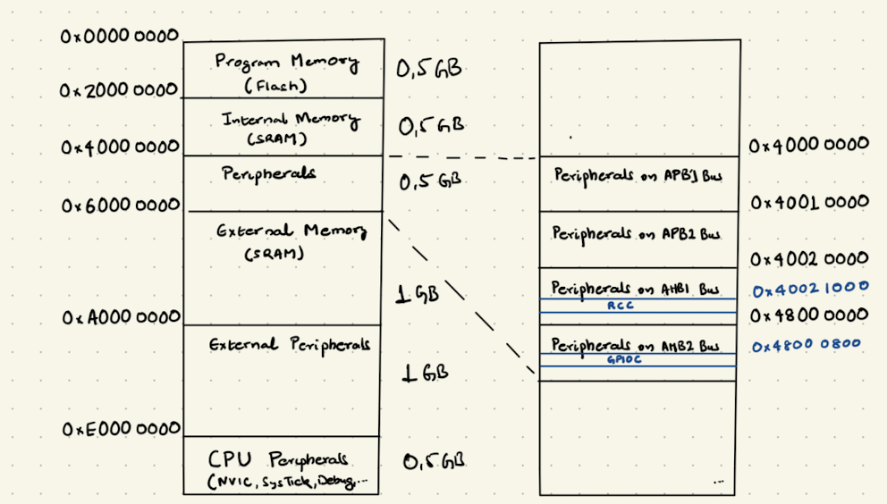

# BareMetal I/O

## Let us go bare-metal!

```{warning} You should have no fear in reading schematics and finding relevant needle information in datasheet stack. 
```

Unlike in high-level languages like micropython, where lot of system level functionality is already provided. In a low-level language like C, one has better performance through direct access to hardware. This makes C, the preferred language for programming in embedded systems. It not only provides high-level abstractions and portability, but is also closer to machine. In this chapter, we will learn the following concepts:

- Memory map
- Registers
- Pointers in C
- Bit Masking
- Standard library

## Registers

Apart from hardware registers in the CPU, the microcontroller has lots of registers in peripherals like GPIO, Timers, … available to programmer for configuring and controlling certain function in them. This enables interaction with external devices from LEDs to Camera sensors. For, the exercise of writing a program to starting the led chaser application on button press event and switching off led chaser on second button press. The following peripherals and some of their registers would need to be programmed in an STM32 microcontroller.

- RCC: Reset and Clock Controller
    - AHB2ENR: turn on the clock for the needed peripherals in application.
- GPIO: General Purpose Input and Output
    - MODER: set the direction of microcontroller pins (e.g. input mode for push-buttons, output mode for LEDs)
    - IDR: For reading the peripheral data (e.g. push-button status)
    - ODR: For writing the peripheral data (e.g. switch the LEDs on or off)
    - PUPDR: In case there are no external pull-up or pull-down registers for the input pins. One can enable or disable, the internal pull-up and pull-down resistors in GPIO Peripherals.

In order to program the registers correctly, one needs to look into datasheet of the microcontroller. For lighting up an LED, the microcontroller pin must be set to low voltage. This is done by using a GPIO peripheral. The reference manual of the microcontroller contains a chapter on GPIO describing its main features, functionality, and registers. GPIO peripheral has multiple instances (Port A to G) and each port has 16 pins. The GPIO output data register (ODR) controls the voltage level of the microcontroller pins. The bit 0 and bit 3 in ODR register sets the voltage level of pin 0 and pin 3 respectively. Therefore, to light up an LED connected to port C and pin 3, the bit 3 must be set to 0. The reset value is the initial value of the register when the system is powered up. What does this mean for our system? One can write and read the values in this register.

## Memory Map

Unlike hardware registers in CPU, the peripheral registers have a address which allows the software to control peripheral by reading or writing from specific memory locations. This concept of memory-mapped I/O is used in all modern microcontrollers. An address is a memory location. In our microcontroller, the address is 32-bit and is represented as unsigned integer (uint32_t in C). Here, the 4GB address space is divided into regions: program memory (internal flash), internal RAM, peripherals, external RAM, external peripherals, and system region.


From the STM32 reference manual, we see that the peripheral region starts at 0x40000000. The Reset and Clock Control (RCC) peripheral is connected to the AHB1 Bus and starts at the Address 0x40021000.Similarly, the GPIOC peripheral starts at the address 0x48000800. The address offset of the GPIOC output data register is 0x14, Therefore one can calculate the address of the register as 0x48000800 + 0x14 = 0x48000814. Using C, one can load of store values (4 bytes) into this register by using the address. C pointers is a great technique for accessing the memory address.

```c
volatile uint32_t *const gpioc_out = (uint32_t *) 0x48000814;
*gpio_cout =0x4;
```

The above line of code will set the microcontroller pin ‘C2’ to 1. Thus, turning off the LED.

## C

When do we use the volatile keyword in C? This is a standard question in embedded systems programming interview. This section will give a quick recap of the C concepts needed for microcontroller programming.