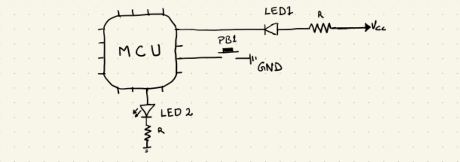

# General Purpose Input and Output
```{warning} You should have no fear in reading schematics and finding relevant needle information in datasheet stack. 
```
Digital Input and Outputs are found in all embedded systems. In physical world, it is not only need for interaction with users but also machines. They are used for interfacing with pushbuttons, LEDs in coffee machines to pressure switch, motors in a sliding door. The word digital suggests that the value of input or output can only be 1 or 0. The value signifies the state of the input/output as on/off, true/false, …. which are obtained by applying high/low voltages to the microcontroller pin. Your firmware code can read or set the voltages of microcontroller pin by reading or writing the values from I/O registers. 



For a light-emitting diode (LED 1) to glow, a certain amount of current should flow through it. If one LED pin is connected to the Voltage (V_CC) and other pin to microcontroller pin over a current-limiting resistor. On applying low voltage to microcontroller pin, one can light up an LED and on applying high voltage to the microcontroller pin the LED will switch off. Here, the software sets the relevant bit in a register to 0, so that low voltage is set on corresponding microcontroller pin for the LED to glow. If the relevant bit is set to 1, then high voltage on microcontroller pin means that LED does not glow. Alternating values of 0 and 1 leads to blinking of LED which lightens up the festive season.

A push-button (PB1) pin is connected to ground and other to microcontroller input pin. When button is pressed, one can read the state of the microcontroller pin as 0. However, if the button is released, the pin value will float between 0 and 1. External noise (e.g. from piezo electric lighter) can cause inadvertent change in state of the pin. Therefore, pull-up or pull-down resistors are used to address this issue. 

Firmware code consists of a initialisation part and a forever loop part which implements the application logic. For a simple application, where a status LED goes on whenever a system goes live, one has implement

- initialisation: determine the microcontroller pin connected to led and set microcontroller pin to output.
- application: set pin value to ‘on’

Therefore, when developing a system it important to determine the following for correct initialisation.

- Which port pins are the digital signals connected?
- Are the digital signal for input or output components?
- whether, the output signal value 1 or 0 determines the off state of the LED.
- whether, the input signal value 1 or 0 determines the pressed state of the button.
- falling or rising flank for digital inputs (i.e. transition from 1 to 0 or 0 to 1, respectively) should trigger a change in application state.

For writing the application logic, it is important to think about the application requirements and model a possible solution architecture. This aids one in programming and debugging. Therefore, one has to

- model a solution using flowcharts, event diagrams, state machines, ….
- think about how to test your applications, particularly the real world corner cases.

## Initialisation

This part of the program code is executed once in the beginning to initialise the system. After initialisation, the application logic is implemented forever in a loop as long as the system is powered. Very often incorrect initialisation is the reason for the application not working. 

### Pins and their Configuration

Microcontroller pins are a rare commodity. Therefore, pins can have different modes

- analog:
- input:
- output:
- alternate function:

In case of digital input or output, o

### Pull-ups and Pull-downs


## Forever Loop for Application

After correct initialisation, an incorrect application logic or partly working application logic can lead to lots of frustration. Therefore, it is of utmost importance to model the application and think of some tests to validate the application logic.

### How can i blink my LED?

- set pin value to 0 or 1 depending in low active
- waveform, delay, and sleep
- 

### My application meets Real World

- Polling and Problems
- Bouncing and Debouncing

